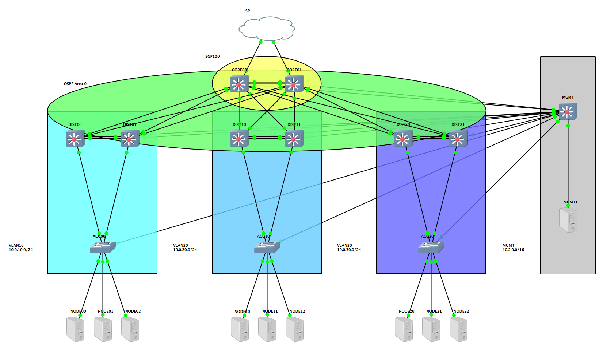

# Hierarchical Network Topology

Hierarchical network topology built in GNS3.  Deployed with [Cluster](https://github.com/shibusa/cluster).

## Diagram

## Test Environment
- GNS3 2.0.2 running c3725-adventerprisek9-mz.124-25d.bin image
- VirtualBox 5.1.22 running Centos 7.3

###Naming Convention
Layer - Pair # - Device # in Pair
DIST21 - 2nd device in 3rd distribution layer pair

###All non-management VLAN devices
| Interface(s) | VLAN | Network | Description |
| --- | --- | --- | --- |
| Fa1/15 | MGMT | 10.2.0.0/16 | All devices have Fa1/15 set up as the management interface. |

###Core Layer
| Interface(s) | VLAN | Network | Description |
| --- | --- | --- | --- |
| Fa0/0 | | 1.0.x.1/30 | Uplink to ISP |
| Lo0 | | 100.0.0.0/24 | Used to source for BGP.  Prevents immediate teardown of BGP sessions in multiple path setups. |
| Po1 | 3 | | Fa0/0 - 1 redundant bundle between core switches|
| Fa1/2 - 14 | 3 | | Connects to distribution switches |
| Vlan3 | | 172.16.x.0/24 | VLAN interface for OSPF |

Core layer switches are designated routers for their respective networks which are both in OSPF area 0.  This allows for multi-pathing across the area and ensures traffic on both devices.

###Distribution Layer
| Interface(s) | VLAN | Network | Description |
| --- | --- | --- | --- |
| Fa0/0 | | 172.16.x.0/24 | Connects to CORE00 Network for OSPF Area0 |
| Fa0/1 | | 172.16.x.0/24 | Connects to CORE01 Network for OSPF Area0 |
| Po1 | 3 | | Fa0/0 - 1 redundant bundle between distribution switches|
| Fa 1/2 - 14 | x | | Connects to access switches |
| Vlanx | | 10.0.x.0/24  | VLAN interface to take part in VRRP for devices in VLAN |

DISTx0 acts as primary root bridge and DISTX1 as secondary.  They both take part in VRRP on the VLAN interface to act as the default gateway for the access layer.
